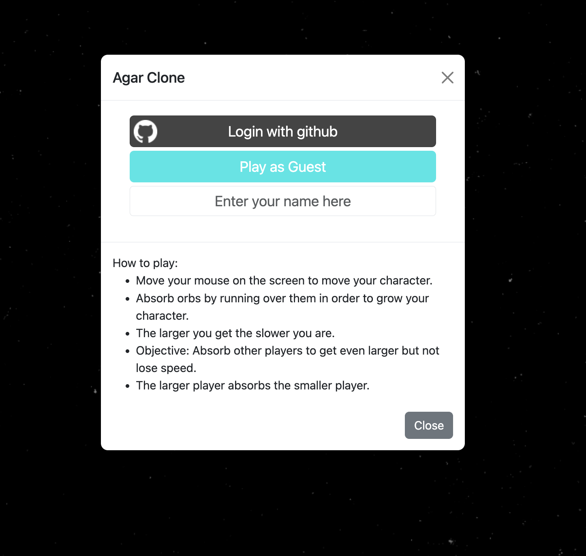
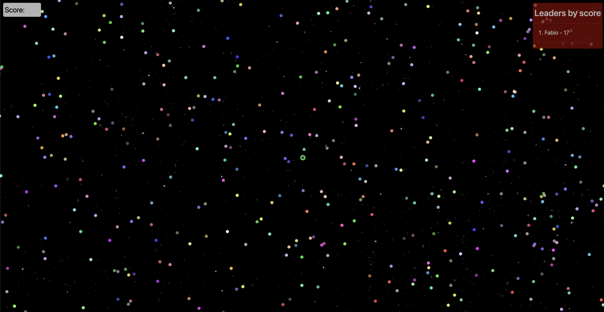

# Agar Clone Game

## Overview

This is a clone of the popular online multiplayer game "Agar.io" created using JavaScript and Socket.io. In this game, players control a cell and aim to grow by consuming smaller cells while avoiding larger ones. It offers real-time multiplayer functionality, allowing multiple players to compete in the same game world.





## Features

- Real-time multiplayer gameplay
- Simple and intuitive controls
- Dynamic, scalable game world
- Player leaderboard to track progress
- Smooth animations and game mechanics
- Customizable settings and game modes

## Getting Started

To run this game on your local machine, follow these steps:

1. Clone this repository to your local system:

   ```shell
   git clone git@github.com:FabioDiCeglie/AgarCloneGame.git
   ```

2. Install the required dependencies:

   ```shell
   yarn
   ```

3. Start the server:

   ```shell
   yarn start
   ```

5. Open a web browser and access the game at `http://localhost:9000`.

## How to Play

1. When you start the game, you will control a small cell.
2. Move your cell by moving the mouse cursor.
3. Consume smaller cells by colliding with them to grow in size.
4. Avoid larger cells as they can consume you.
7. Try to reach the top of the leaderboard by growing your cell as large as possible.

## Customization

You can customize various aspects of the game, including:

- **Game World Size**: Adjust the size of the game world in the `socket/index.js` file.
- **Cell Color**: Modify the cell colors in the `public/canvas.js` file.

## Technologies Used

- [JavaScript](https://developer.mozilla.org/en-US/docs/Web/JavaScript)
- [Socket.io](https://socket.io/)
- [HTML5](https://developer.mozilla.org/en-US/docs/Web/Guide/HTML/HTML5)
- [CSS3](https://developer.mozilla.org/en-US/docs/Web/CSS)
- [Node.js](https://nodejs.org/)

**Happy Gaming!** 🎮